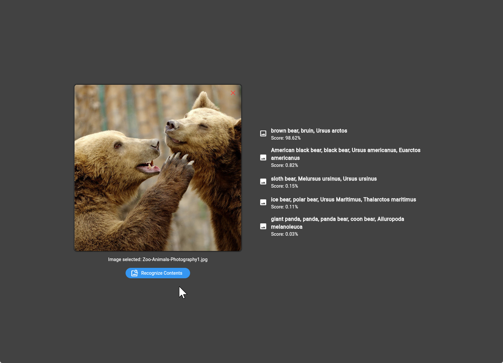

# Image Recognition App

This Flutter application demonstrates how to create a web-based image recognition tool using the HuggingFace API. Users can select an image from their device, and the app will analyze it using a pre-trained vision model to identify objects and concepts within the image. The app showcases Flutter's capabilities for building interactive UIs and integrating with external APIs for ML tasks.

## Understanding HuggingFace

HuggingFace is an open-source platform specializing in ML, particularly NLP and computer vision. It offers a vast array of pre-trained models and tools for AI tasks. The `google/vit-base-patch16-224` model used in this Flutter app is one such offering. It is a Vision Transformer (ViT) model developed by Google, designed for image classification tasks. The base version balances performance and efficiency, processes images in 16x16 pixel patches, and is optimized for 224x224 pixel input images. This model enables the app to analyze uploaded images and identify objects or concepts within them, showcasing the integration of advanced AI capabilities in a user-friendly mobile application.

## Screenshots

Screen 1


Screen 2


## Setup Instructions

To setup this project, follow the given steps:

1. **Create a new project**: Create a new Flutter web project - `image_recognition_app`.
2. **Add required libraries**: Open the `pubspec.yaml`, add the following dependencies:
   ```yaml
   dependencies:
     flutter:
       sdk: flutter
     image_picker: ^1.1.2
     image_picker_for_web: ^3.0.5
     huggingface_client: ^1.2.3
   ```
3. **Install dependencies**: Run `flutter pub get` in the terminal.
4. **Set up project files**: Create the required folders and files in your project structure:
   - `screens/image_selection/image_selection_screen.dart`
   - `screens/image_selection/image_selection_web.dart`
   - `screens/responsive_layout.dart`

## Main Dart File

The `main.dart` file is the main entry point of the app. It sets up the application's title, themes, and home screen. Below is the code for `main.dart`:

```dart
import 'package:flutter/material.dart';
import 'screens/image_selection/image_selection_screen.dart';

void main() {
  runApp(const ImageRecognitionApp());
}

class ImageRecognitionApp extends StatelessWidget {
  const ImageRecognitionApp({super.key});

  @override
  Widget build(BuildContext context) {
    return MaterialApp(
        title: 'Image Recognition App',
        theme: ThemeData(
            colorScheme: ColorScheme.fromSwatch(
          brightness: Brightness.light,
        )),
        darkTheme: ThemeData(
            colorScheme: ColorScheme.fromSwatch(
          brightness: Brightness.dark,
        )),
        home: const ImageSelectionScreen(),
        debugShowCheckedModeBanner: false);
  }
}
```

## Image Selection Screen

Create the `ImageSelectionScreen` stateless widget in the `image_selection_screen.dart` file and set the web layout to be `ImageSelectionWeb()`.

## Image Selection Web

The `image_selection_web.dart` file implements an `ImageSelectionWeb` stateful widget which allows users to upload an image from their device, interact with the Hugging Face API, and display the classification results. The application provides a button to trigger the recognition process and shows the results, including labels and confidence scores for the detected items. Users can reset the image and try again.
